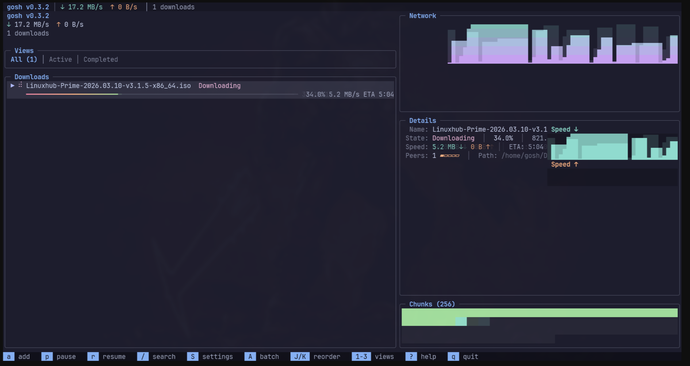

# gosh-dl-cli

[](https://crates.io/crates/gosh-dl-cli)
[](https://docs.rs/gosh-dl/0.6.3/gosh_dl/)
[](LICENSE)

A download manager for the terminal. HTTP/HTTPS with multi-connection acceleration, full BitTorrent support, and an optional TUI. Built on [gosh-dl](https://github.com/goshitsarch-eng/gosh-dl).

## Features

- **HTTP/HTTPS downloads** with multi-connection acceleration, resume, retries, mirrors, checksum verification, and speed limits
- **Full BitTorrent support** -- torrents and magnet links with DHT, PEX, LPD, sequential mode, file selection, and seed ratio control
- **Recursive HTTP mirroring** (`gosh mirror`) -- crawl a directory listing and download everything under it, wget -r style, with depth limits, include/exclude globs, dry-run previews, and saved mirror jobs for later resume
- **Three usage modes** -- aria2-style direct downloads with progress bars, a full-screen TUI, and scriptable subcommands with JSON output
- **Batch operations** -- `pause-all`, `resume-all`, and `cancel-all` (CLI and TUI) with per-download outcome reporting
- **Interactive TUI** -- live speed graphs, estimated progress map, data verification/repair, search/filtering, activity log, settings editor, batch URL import, and mirror job tracking
- **Persistent queue** -- downloads survive restarts via SQLite (default), aria2-style JSON sidecar files, or no persistence at all (`storage_backend`)
- **Bandwidth scheduling** -- time-of-day and day-of-week speed limit rules
- Cross-platform: Linux, macOS, and Windows

### What's new in 0.6.3

Upgraded to gosh-dl 0.6.3, including authenticated HTTP probe fixes, safer
nested paths, torrent pause/resume and repair fixes, and improved uTP recovery.
CLI downloads now report failures correctly, `resume` stays in the foreground,
and Ctrl+C preserves downloads for resume. Queued downloads and mirror jobs
are explicitly saved paused. The release workflow publishes to crates.io using
Trusted Publishing and ships all six platform binaries with checksums.
See [CHANGELOG.md](CHANGELOG.md) and [ROLLOUT.md](ROLLOUT.md) for details.

## Screenshots



## Install

From source (requires Rust 1.88+):

```bash
git clone https://github.com/goshitsarch-eng/gosh-dl-cli
cd gosh-dl-cli
cargo build --release
cp target/release/gosh ~/.local/bin/   # or /usr/local/bin/
```

From crates.io:

```bash
cargo install gosh-dl-cli --version 0.6.3 --locked
```

Arch Linux (AUR):

```bash
yay -S gosh-dl-cli
```

Without the TUI (smaller binary, fewer dependencies):

```bash
cargo install gosh-dl-cli --version 0.6.3 --locked --no-default-features
```

Pre-built binaries are available on [GitHub Releases](https://github.com/goshitsarch-eng/gosh-dl-cli/releases). Linux builds are statically linked with musl.

## Quick start

Download a file:

```bash
gosh https://example.com/file.zip
```

Download to a specific directory with a custom filename:

```bash
gosh -d ~/Downloads -o archive.zip https://example.com/file.zip
```

Multiple files at once:

```bash
gosh https://example.com/a.zip https://example.com/b.zip
```

Torrents and magnet links work the same way:

```bash
gosh magnet:?xt=urn:btih:...
gosh ./ubuntu.torrent
```

Mirror an HTTP directory listing recursively (wget -r style):

```bash
gosh mirror https://ftp.gnu.org/gnu/hello/
```

Launch the interactive TUI by running `gosh` with no arguments.

## Usage modes

gosh has three modes:

**Direct mode** -- pass URLs as arguments and downloads start immediately with progress bars. This is the aria2-style workflow most people want.

**TUI mode** -- run `gosh` with no arguments for a full-screen terminal interface. You can add, pause, resume, and monitor downloads interactively.

**Command mode** -- use subcommands (`gosh add`, `gosh list`, etc.) for scripting and automation.

`gosh` has no daemon or IPC service. Use one process per storage location:
subcommands operate on saved state and do not control another running TUI or
CLI process. For background transfers, keep a foreground command running in
a terminal multiplexer or a service manager. `--enqueue` (formerly described
as `--detach`) saves a paused mirror; it does not leave a worker running.

Ctrl+C in direct downloads, `add --wait`, `resume`, and foreground mirrors
pauses unfinished work and exits with code 130. With SQLite or file storage,
use `gosh resume all` or the TUI to continue. With `storage_backend = "none"`,
no state survives exit, so queue-only commands are rejected.

## CLI reference

### Global options

These work with any mode or subcommand:

| Flag | Description |
|------|-------------|
| `-c, --config <PATH>` | Config file path (env: `GOSH_CONFIG`) |
| `-v, --verbose` | Increase log verbosity (`-v`, `-vv`, `-vvv`) |
| `-q, --quiet` | Suppress output except errors |
| `--output <FORMAT>` | Output format: `table`, `json`, `json-pretty` |
| `--color <WHEN>` | Color output: `auto`, `always`, `never` |
| `--proxy <URL>` | Proxy URL (`http://`, `https://`, `socks5://`) |
| `--max-retries <N>` | Maximum HTTP attempts including the first; must be at least 1 |

### Direct mode options

Used when passing URLs directly (`gosh [OPTIONS] <URL>...`):

| Flag | Description |
|------|-------------|
| `-d, --dir <PATH>` | Output directory |
| `-o, --out <NAME>` | Output filename (single download only) |
| `-x, --max-connections <N>` | Connections per download (default: 8) |
| `--max-speed <SPEED>` | Speed limit (supports `K`/`M`/`G` suffixes) |
| `-H, --header <HEADER>` | Custom header (`"Name: Value"`) |
| `--user-agent <UA>` | User agent string |
| `--referer <URL>` | Referer URL |
| `--cookie <COOKIE>` | Cookie (`"name=value"`) |
| `--checksum <HASH>` | Verify checksum (`md5:...` or `sha256:...`) |
| `--sequential` | Download pieces in order (torrents) |
| `--select-files <IDX>` | Download specific files (comma-separated, torrents) |
| `--seed-ratio <RATIO>` | Stop seeding after this ratio (torrents) |
| `--no-dht` | Disable DHT |
| `--no-pex` | Disable Peer Exchange |
| `--no-lpd` | Disable Local Peer Discovery |
| `--max-peers <N>` | Max peers per torrent |

### Subcommands

**`gosh add <URL>...`** -- Save downloads paused for later resume. Use `--wait`
to download now and wait for completion. Saving without `--wait` requires
SQLite or file storage.

Accepts all the direct mode options above, plus:

| Flag | Description |
|------|-------------|
| `-p, --priority <LEVEL>` | `low`, `normal`, `high`, `critical` |
| `-w, --wait` | Download in the foreground and return its success/failure exit code |
| `-i, --input-file <FILE>` | Read URLs from a file (one per line) |

**`gosh list`** -- List all downloads.

| Flag | Description |
|------|-------------|
| `-s, --state <STATE>` | Filter: `active`, `waiting`, `paused`, `completed`, `error` |
| `--ids-only` | Print only download IDs |

**`gosh status <ID>`** -- Show detailed status of a download.

| Flag | Description |
|------|-------------|
| `--peers` | Show peer info (torrents) |
| `--files` | Show file list (torrents) |

**`gosh pause <ID>...`** -- Pause downloads. Use `all` to pause everything.

**`gosh resume <ID>...`** -- Resume paused downloads and wait for completion. Use `all` to resume everything.

**`gosh cancel <ID>...`** -- Cancel downloads.

| Flag | Description |
|------|-------------|
| `--delete` | Also delete downloaded files |
| `-y, --yes` | Skip confirmation |

**`gosh pause-all`** / **`gosh resume-all`** / **`gosh cancel-all`** -- Batch operations across saved downloads, reporting per-download outcomes (succeeded / skipped / failed). `resume-all` remains in the foreground until the resumed downloads finish.

| Flag (`cancel-all`) | Description |
|------|-------------|
| `--delete-files` | Also delete downloaded files |
| `-y, --yes` | Skip confirmation |

> **Note:** as of gosh-dl 0.5.0, pausing also holds *queued* downloads, so `pause all` / `pause-all` freezes the whole queue instead of letting waiting downloads get promoted into freed slots.

**`gosh mirror <URL>`** -- Recursively mirror an HTTP/HTTPS directory listing (like `wget -r`). See [Mirroring](#mirroring-recursive-http) below.

**`gosh priority <ID> <LEVEL>`** -- Set download priority (`low`, `normal`, `high`, `critical`).

**`gosh stats`** -- Show global download/upload statistics.

**`gosh info <FILE>`** -- Parse and display torrent file metadata.

**`gosh config <ACTION>`** -- Manage configuration: `show`, `path`, `get <KEY>`, `set <KEY> <VALUE>`.

**`gosh completions <SHELL>`** -- Generate shell completions for `bash`, `zsh`, `fish`, `elvish`, or `powershell`. Pipe the output to the appropriate completions directory for your shell.

## Mirroring (recursive HTTP)

`gosh mirror` crawls a directory-listing page and downloads every file it discovers, preserving the remote directory structure locally:

```bash
# Mirror a directory tree
gosh mirror https://ftp.gnu.org/gnu/hello/

# Preview what would be downloaded without downloading anything
gosh mirror --dry-run --depth 2 https://ftp.gnu.org/gnu/hello/

# Only .iso and .sig files, two levels deep, into ~/mirrors
gosh mirror -d ~/mirrors --depth 2 --include '*.iso' --include '*.sig' \
    https://example.com/releases/

# Save the mirror paused for later resume
gosh mirror --enqueue https://example.com/files/
gosh mirror list
gosh mirror status <ID>
gosh mirror cancel <ID>
gosh mirror remove <ID> --delete-files
```

| Flag | Description |
|------|-------------|
| `-d, --dir <PATH>` | Output directory (root of the mirrored tree) |
| `--depth <N>` | Maximum traversal depth (default: 16) |
| `--include <GLOB>` | Only download matching files (repeatable) |
| `--exclude <GLOB>` | Skip matching files (repeatable) |
| `--prefix <PREFIX>` | Restrict discovered URLs to a path prefix |
| `--span-hosts` | Follow links to other hosts (off by default) |
| `--flatten` | Put all files in one directory instead of preserving paths |
| `--overwrite` | Overwrite existing local files |
| `--fail-fast` | Abort remaining files after the first failure |
| `--discovery-concurrency <N>` | Concurrent page-fetch requests (default: 4) |
| `--dry-run` | Discover and list files without downloading |
| `--enqueue` (alias `--detach`) | Save the mirror paused for later resume; requires persistence |

HTTP options from direct mode (`-H`, `--user-agent`, `--referer`, `--cookie`, `-x`, `--max-speed`) also apply to each mirrored file. Overall download parallelism is governed by `engine.max_concurrent_downloads` in the config; `--discovery-concurrency` only affects the page crawl.

Mirror exit codes follow the standard table below: `0` all files completed, `1` some failed, `2` all failed, `130` interrupted.

## TUI keyboard shortcuts

| Key | Action |
|-----|--------|
| `a` | Add new download |
| `A` | Batch import URLs (F2 reviews, Enter imports selected entries) |
| `p` | Pause selected |
| `r` | Resume selected |
| `v` | Verify selected download on disk |
| `V` | Verify and repair selected (confirmation required) |
| `c` | Cancel selected |
| `d` | Cancel and delete files |
| `P` | Pause ALL downloads (including queued) |
| `R` | Resume ALL paused downloads |
| `C` | Cancel ALL downloads (with confirmation) |
| `/` | Search/filter the list (Ctrl+S cycles scope, Enter commits, Esc clears) |
| `S` | Open settings; Esc saves and closes |
| `L` | Toggle activity log |
| `[` / `]` | Scroll activity log |
| Tab | Cycle right-panel focus |
| `1` / `2` / `3` | View all / active / completed or seeding |
| `j`/`k` or arrows | Navigate |
| PgUp / PgDn | Scroll page |
| `J` / `K` | Reorder the visible list only (does not change download priority) |
| `?` | Toggle help overlay |
| `q` or Ctrl+C | Quit |

The details panel shows the selected download's progress, error, path, connections,
and priority. Speed charts show aggregate engine traffic. Active mirror jobs
appear as a compact counter in the top bar. The progress map is estimated from
completed bytes; it is not an actual segment/piece bitmap.

Foreground torrent commands wait through seeding until the configured seed ratio
is reached. The engine treats `--seed-ratio 0` as unlimited seeding; use Ctrl+C
to pause and exit. The TUI continues running while torrents seed.

Pause active downloads before using `v` or `V`. Verification runs in the background;
results stay in the activity log (`L`). HTTP verification uses the stored checksum
when available, otherwise presence/size only (same-size corruption is undetectable).
Repair removes corrupt HTTP data and restarts it, or queues missing/bad torrent
pieces. A “repair queued” result is not a completed download.

Settings honor `--config`; failed saves retain the draft. Theme, refresh rate,
graph/peer visibility, concurrency, and global bandwidth limits update immediately.
Restart for storage, logging, and network client changes. Ctrl+C exits from any
dialog. Help and add/settings/import dialogs support ordinary 80×24 terminals;
very small windows show a reduced layout.

Logs use `general.log_level` unless overridden by `-v`, `--quiet`, or `RUST_LOG`.
Set `general.log_file` to retain diagnostics. The TUI suppresses console logs so
they cannot overwrite the interface; command mode logs go to stderr by default.

## Configuration

Config file location: `~/.config/gosh-dl/config.toml`

Override the path with `-c <PATH>` or the `GOSH_CONFIG` environment variable.

```toml
[general]
download_dir = "~/Downloads"
log_level = "info"                      # overridden by -v / --quiet / RUST_LOG
# log_file = "/path/to/gosh.log"         # optional; useful for TUI diagnostics
storage_backend = "sqlite"              # sqlite (default), file (JSON sidecars), none

[engine]
max_concurrent_downloads = 5
max_connections_per_download = 8
global_download_limit = 0               # bytes/sec, 0 = unlimited
global_upload_limit = 0
max_retries = 3
connect_timeout = 30                    # seconds
read_timeout = 60

# BitTorrent
enable_dht = true
enable_pex = true
enable_lpd = true
max_peers = 55
seed_ratio = 1.0

# Proxy (overridden by --proxy flag or env vars)
# proxy_url = "socks5://127.0.0.1:1080"

# TLS (dangerous -- prefer --insecure flag for one-off use)
# accept_invalid_certs = false

[tui]
refresh_rate_ms = 250
theme = "dark"                          # or "light"
show_speed_graph = true
show_peers = true

# Bandwidth scheduling -- rules are evaluated in order, first match wins
# [[schedule.rules]]
# start_hour = 9
# end_hour = 17
# days = "weekdays"                     # "all", "weekdays", "weekends", or "mon,tue,..."
# download_limit = "2M"                 # K/M/G suffixes
# upload_limit = "512K"
```

## Environment variables

| Variable | Description |
|----------|-------------|
| `GOSH_CONFIG` | Custom config file path |
| `NO_COLOR` | Disable colored output (any value) |
| `HTTPS_PROXY` | HTTPS proxy URL |
| `HTTP_PROXY` | HTTP proxy URL |
| `ALL_PROXY` | Fallback proxy URL |
| `RUST_LOG` | Override log level filter |

Proxy precedence: `--proxy` flag > config file > `HTTPS_PROXY` > `HTTP_PROXY` > `ALL_PROXY`.

## Exit codes

| Code | Meaning |
|------|---------|
| 0 | Command succeeded; foreground downloads completed, or queue-only work was saved |
| 1 | Some downloads failed, or configuration/command validation failed |
| 2 | All monitored downloads failed, or argument parsing failed |
| 130 | Interrupted (Ctrl+C); unfinished work paused for resume when persistence is enabled |

## Building from source

```bash
cargo build --locked            # debug build
cargo build --locked --release  # optimized (LTO + stripped)
cargo test --locked             # run tests
cargo build --locked --no-default-features --release   # without TUI
```

Release builds use thin LTO, symbol stripping, and single codegen unit for smaller binaries.

## Releasing

Changes to `Cargo.toml` or `CHANGELOG.md` on `main` trigger the release workflow.
It can also be run manually on `main`. CI checks formatting, Clippy, Rust 1.88,
and default/TUI-free tests on Linux, macOS, and Windows. It builds six release
archives: Linux musl, macOS, and Windows, each for x86_64 and ARM64.

After validation, the workflow verifies the Cargo package, publishes to
crates.io with a short-lived GitHub OIDC token, and creates a GitHub release
with the six binaries, `.crate` source package, and `SHA256SUMS`.

A crate owner must first add this separate publisher under
[gosh-dl-cli Settings → Trusted Publishing](https://crates.io/crates/gosh-dl-cli/settings):

| Setting | Value |
| --- | --- |
| Provider | GitHub |
| Repository owner | `goshitsarch-eng` |
| Repository name | `gosh-dl-cli` |
| Workflow filename | `release.yml` |
| Environment | Leave empty |

The publisher configured for `gosh-dl` does not authorize `gosh-dl-cli`.
No `cargo login` or permanent API token is needed after setup. Configure the
publisher before merging the release PR. If publishing fails, fix the reported
problem and rerun the failed jobs in Actions. An already-published version is
accepted only if its checksum matches the package and it is not yanked;
existing GitHub releases are left unchanged.

## License

MIT -- see [LICENSE](LICENSE).
